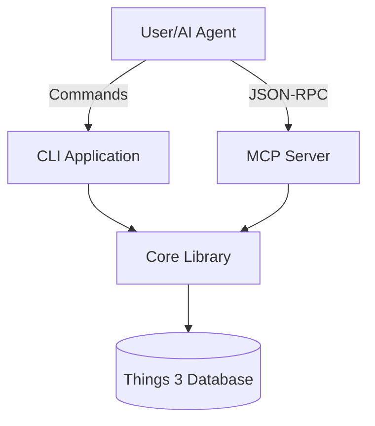
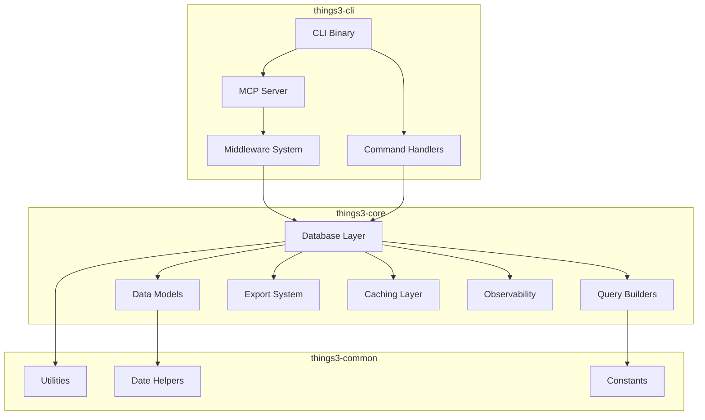
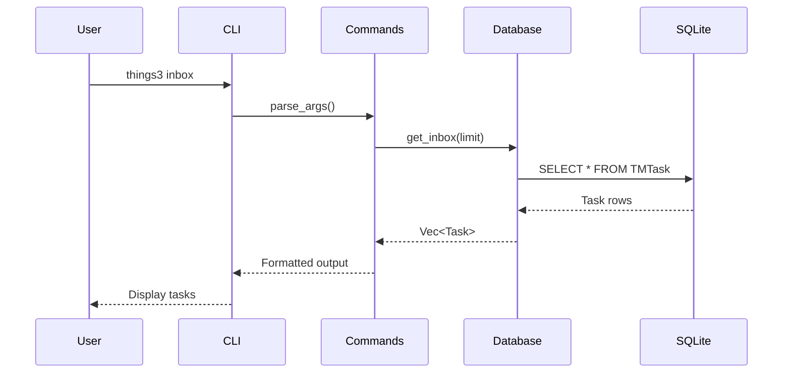
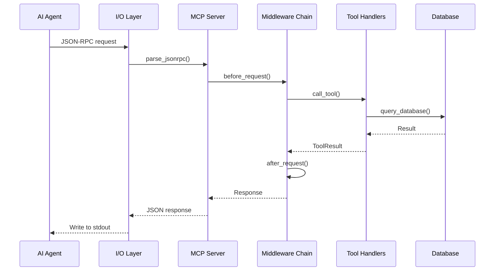
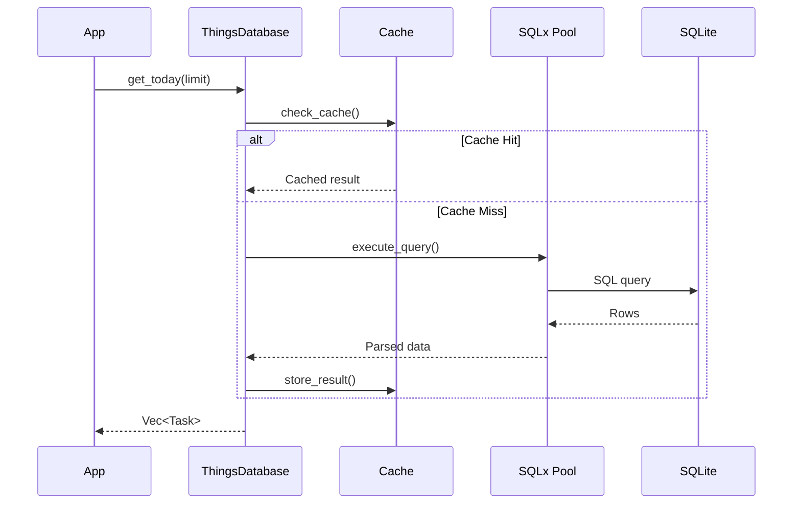
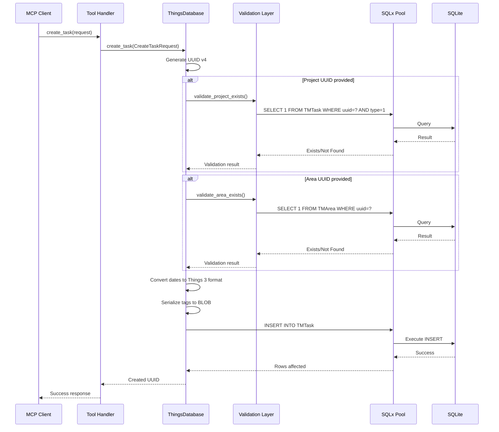
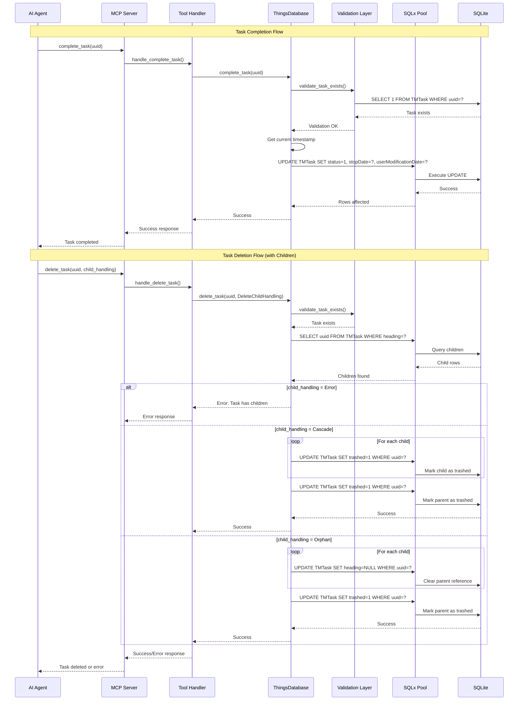
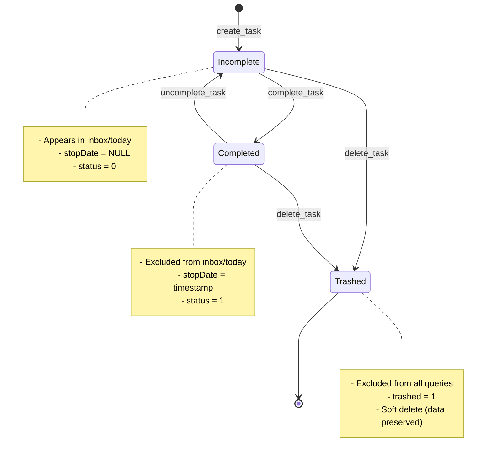

# rust-things3 Architecture

## Table of Contents
- [System Overview](#system-overview)
- [Component Architecture](#component-architecture)
- [Data Flow](#data-flow)
- [Module Boundaries](#module-boundaries)
- [Design Decisions](#design-decisions)
- [Technology Stack](#technology-stack)

## System Overview

`rust-things3` is a high-performance Rust library and CLI tool for integrating with Things 3, featuring a built-in MCP (Model Context Protocol) server for AI/LLM integration.

### High-Level Architecture



###Key Features
- **Async-first design**: Built on Tokio for concurrent operations
- **Type-safe database access**: SQLx for compile-time SQL verification
- **MCP Protocol**: Industry-standard AI agent communication
- **Middleware system**: Extensible request/response processing
- **Observability**: Built-in metrics, logging, and tracing

## Component Architecture

### Workspace Structure

The project is organized as a Moon-managed Rust workspace:

```
rust-things3/
├── apps/
│   └── things3-cli/          # CLI application with MCP server
├── libs/
│   ├── things3-core/         # Core database and business logic
│   └── things3-common/       # Shared utilities
├── tools/
│   └── xtask/                # Development automation
└── tests/                    # Integration tests
```

### Component Diagram



## Data Flow

### CLI Command Flow



### MCP Server Flow



### Database Query Flow (Read Operations)



### Database Write Flow (Create/Update Operations)



### Task Lifecycle Flow (Complete/Delete Operations)



### Task Lifecycle State Machine



## Module Boundaries

### things3-core

**Purpose**: Core database access and business logic

**Responsibilities**:
- Database connection management (async, thread-safe)
- Data model definitions (Task, Project, Area, etc.)
- Query builders and execution
- Data export (JSON, CSV, OPML, Markdown)
- Caching layer (Moka-based)
- Date/time conversions (Things 3 ↔ Chrono)
- Observability (metrics, logging, tracing)

**Key Types**:
- `ThingsDatabase`: Main async database interface
- `Task`, `Project`, `Area`: Core data models
- `ThingsConfig`: Configuration management
- `ThingsError`: Unified error handling

**Dependencies**:
- `sqlx`: Async database access
- `tokio`: Async runtime
- `moka`: High-performance caching
- `chrono`: Date/time handling
- `serde`: Serialization

### things3-cli

**Purpose**: CLI application and MCP server

**Responsibilities**:
- Command-line interface
- MCP server implementation
- JSON-RPC protocol handling
- Middleware system (logging, validation, auth, rate limiting)
- I/O abstraction (stdin/stdout, testable)
- Tool implementations (17 MCP tools)

**Key Types**:
- `Cli`: CLI argument parser
- `ThingsMcpServer`: MCP server implementation
- `McpIo` trait: Testable I/O abstraction
- `MiddlewareChain`: Request/response processing
- `CallToolRequest`/`CallToolResult`: MCP types

**Dependencies**:
- `things3-core`: Database access
- `clap`: CLI argument parsing
- `serde_json`: JSON handling
- `tokio`: Async I/O
- `tracing`: Structured logging

### things3-common

**Purpose**: Shared utilities across workspace

**Responsibilities**:
- Date/time formatting and parsing
- String utilities
- Constants and enums
- UUID validation
- Path utilities

**Key Functions**:
- `get_default_database_path()`: Platform-specific DB location
- `format_date()`, `parse_date()`: Date conversions
- `is_valid_uuid()`: UUID validation
- `truncate_string()`: String manipulation

**Dependencies**: Minimal (chrono, regex)

## Design Decisions

### 1. Async-First Architecture

**Decision**: Use Tokio and async/await throughout

**Rationale**:
- Things 3 database can be large (thousands of tasks)
- MCP server needs concurrent request handling
- Non-blocking I/O for responsive CLI
- Better resource utilization

**Trade-offs**:
- Increased complexity (lifetimes, Send/Sync)
- Steeper learning curve
- Worth it for performance gains

### 2. SQLx Over ORMs

**Decision**: Use SQLx instead of Diesel or other ORMs

**Rationale**:
- Compile-time SQL verification
- Better async support
- Direct SQL control for complex queries
- Things 3 schema is read-only (no migrations needed)

**Trade-offs**:
- More boilerplate than ORM
- Manual query writing
- Worth it for type safety and async

### 3. MCP I/O Abstraction

**Decision**: Abstract I/O behind `McpIo` trait

**Rationale**:
- Enable comprehensive testing
- Decouple from stdin/stdout
- Support future transport options (HTTP, WebSocket)
- Critical for integration tests

**Implementation**:
- `StdIo`: Production (stdin/stdout)
- `MockIo`: Testing (DuplexStream)

### 4. Middleware Chain Pattern

**Decision**: Implement middleware chain for MCP server

**Rationale**:
- Cross-cutting concerns (logging, auth, metrics)
- Extensible request/response processing
- Priority-based execution order
- Industry-standard pattern

**Middleware Types**:
- LoggingMiddleware: Request/response logging
- ValidationMiddleware: Input validation
- PerformanceMiddleware: Timing and metrics
- AuthenticationMiddleware: API key/JWT auth
- RateLimitMiddleware: Request throttling

### 5. Moka for Caching

**Decision**: Use Moka over other caching solutions

**Rationale**:
- High performance (async, lock-free)
- TTL and size-based eviction
- Thread-safe by design
- Built for Rust async

**Configuration**:
- Max capacity: 1000 entries
- TTL: 5 minutes
- Idle timeout: 1 minute

### 6. Date Conversion Strategy

**Decision**: Custom Things 3 date ↔ NaiveDate conversion

**Things 3 Format**: Seconds since 2001-01-01 00:00:00 UTC

**Implementation**:
```rust
const THINGS_EPOCH: i64 = 978307200; // 2001-01-01 in Unix time

pub fn from_things_date(seconds: i64) -> NaiveDate {
    let unix_timestamp = THINGS_EPOCH + seconds;
    // Convert to NaiveDate
}
```

**Rationale**:
- Things 3 uses non-standard epoch
- Need bidirectional conversion
- Handle null dates gracefully

### 7. Moon Workspace Management

**Decision**: Use Moon instead of Cargo workspace alone

**Rationale**:
- Task orchestration and caching
- Project graph and dependencies
- Multi-language support (future)
- Developer experience improvements

**Benefits**:
- `moon run :dev-pipeline`: Full dev workflow
- `moon run :test-all`: All tests across workspace
- Incremental builds and caching

### 8. Error Handling Strategy

**Decision**: Custom `ThingsError` enum with context

**Types**:
- `DatabaseError`: SQLx errors
- `ParseError`: Data parsing issues
- `NotFound`: Missing resources
- `ValidationError`: Invalid input
- `UnknownError`: Catch-all

**Pattern**:
```rust
pub type Result<T> = std::result::Result<T, ThingsError>;
```

**Rationale**:
- Type-safe error handling
- Context preservation
- Unified error conversion
- Better error messages

## Technology Stack

### Core Technologies
- **Language**: Rust 1.70+
- **Async Runtime**: Tokio
- **Database**: SQLx (async SQLite)
- **CLI**: Clap v4
- **Caching**: Moka
- **Serialization**: Serde

### Observability
- **Logging**: tracing + tracing-subscriber
- **Metrics**: Custom (future: Prometheus)
- **Tracing**: OpenTelemetry (future)

### Development
- **Build System**: Moon + Cargo
- **Testing**: Tokio test, proptest
- **Coverage**: cargo-llvm-cov
- **Linting**: Clippy
- **Formatting**: rustfmt

### CI/CD
- **Platform**: GitHub Actions
- **Coverage**: Codecov
- **Security**: cargo-audit

## Performance Considerations

### Database Access
- **Connection Pooling**: SQLx pool (min: 1, max: 10)
- **Read-Only**: Things 3 DB is never modified
- **Prepared Statements**: Cached for reuse
- **Async Queries**: Non-blocking I/O

### Caching Strategy
- **Cache Keys**: Query + params
- **Eviction**: LRU + TTL
- **Size Limit**: 1000 entries
- **Hit Rate Target**: 80%+

### MCP Server
- **Request Handling**: Concurrent (Tokio)
- **Middleware**: Priority-ordered execution
- **I/O**: Async stdin/stdout
- **Serialization**: Zero-copy when possible

## Security Considerations

### Database Access
- **Read-Only**: No write operations
- **Path Validation**: Prevent directory traversal
- **Permission Checks**: Verify file access

### MCP Server
- **Optional Auth**: API key or JWT
- **Rate Limiting**: Prevent abuse
- **Input Validation**: All tool parameters
- **Error Sanitization**: No sensitive data in errors

### Data Export
- **Path Sanitization**: Prevent writes outside allowed dirs
- **File Permissions**: Appropriate access controls
- **Content Escaping**: Prevent injection in exports

## Testing Strategy

### Unit Tests
- **Location**: Alongside source code (`#[cfg(test)]`)
- **Focus**: Individual functions and structs
- **Coverage**: 554 tests total

### Integration Tests
- **Location**: `tests/` directories
- **Focus**: End-to-end workflows
- **Tools**: MockIo for MCP testing

### Test Categories
1. **Database Operations** (Phase 1): Core CRUD operations
2. **MCP I/O Layer** (Phase 2): Protocol and transport
3. **Middleware Chain** (Phase 3): Request processing
4. **Observability** (Phase 4): Logging and metrics

### Coverage
- **Current**: ~78% (554 tests)
- **Target**: 85%+
- **Tool**: cargo-llvm-cov
- **CI**: Codecov integration

## Future Architecture Considerations

### Planned Enhancements
1. **HTTP Server**: Alternative to stdio transport
2. **WebSocket Support**: Real-time updates
3. **Database Watching**: React to Things 3 changes
4. **Plugin System**: Custom tool development
5. **Multi-DB Support**: Multiple Things 3 databases

### Scalability
- **Current**: Single-process, single-database
- **Future**: Multi-tenant, connection pooling
- **Caching**: Distributed cache (Redis)

### Monitoring
- **Metrics**: Prometheus integration
- **Tracing**: OpenTelemetry export
- **Dashboards**: Grafana templates
- **Alerting**: Performance and error thresholds

## References

- [MCP Protocol Specification](https://modelcontextprotocol.io)
- [Things 3 Database Schema](./DATABASE_SCHEMA.md)
- [MCP Integration Guide](./MCP_INTEGRATION.md)
- [Development Guide](./DEVELOPMENT.md)
- [Coverage Analysis](./COVERAGE_ANALYSIS.md)

