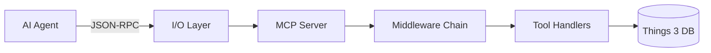

# MCP Integration Guide

## Table of Contents
- [Overview](#overview)
- [Quick Start](#quick-start)
- [Available Tools](#available-tools)
- [Configuration](#configuration)
- [Middleware System](#middleware-system)
- [Custom Tool Development](#custom-tool-development)
- [Error Handling](#error-handling)
- [Testing](#testing)
- [Advanced Topics](#advanced-topics)

## Overview

The MCP (Model Context Protocol) server provides a standardized interface for AI agents to interact with Things 3 data. It implements the MCP specification for tool calling, resource access, and prompt management.

### Architecture



### Key Features
- **21 Tools**: Comprehensive Things 3 operations including bulk operations
- **Middleware System**: Logging, validation, auth, rate limiting
- **Async I/O**: Non-blocking request handling
- **Type-Safe**: Compile-time validation
- **Testable**: MockIo for integration testing
- **Transactional**: Bulk operations with all-or-nothing guarantees

## Quick Start

### Starting the MCP Server

```bash
# Start with default configuration
things3 mcp

# With custom database path
things3 mcp --database-path /path/to/things.db

# With verbose logging
RUST_LOG=debug things3 mcp
```

### Configuration Files

#### Cursor
```json
// .cursor/mcp.json
{
  "mcpServers": {
    "things3": {
      "command": "things3",
      "args": ["mcp"],
      "env": {
        "THINGS_DB_PATH": "/path/to/things.db",
        "RUST_LOG": "info"
      }
    }
  }
}
```

#### VS Code
```json
// .vscode/mcp.json
{
  "servers": {
    "things3": {
      "type": "stdio",
      "command": "things3",
      "args": ["mcp"],
      "cwd": "${workspaceFolder}",
      "env": {
        "THINGS_DB_PATH": "/path/to/things.db"
      }
    }
  }
}
```

#### Zed
```json
// .zed/settings.json
{
  "mcp": {
    "things3": {
      "command": "things3",
      "args": ["mcp"],
      "env": {
        "THINGS_DB_PATH": "/path/to/things.db"
      }
    }
  }
}
```

## Available Tools

### Data Retrieval Tools

#### `get_inbox`
Get tasks from the inbox.

**Parameters**:
- `limit` (optional): Maximum number of tasks (default: 50)

**Example**:
```json
{
  "name": "get_inbox",
  "arguments": {
    "limit": 10
  }
}
```

#### `get_today`
Get tasks scheduled for today.

**Parameters**:
- `limit` (optional): Maximum number of tasks

**Example**:
```json
{
  "name": "get_today",
  "arguments": {
    "limit": 20
  }
}
```

#### `get_projects`
Get all projects, optionally filtered by area.

**Parameters**:
- `area_uuid` (optional): Filter by area UUID
- `limit` (optional): Maximum number of projects

**Example**:
```json
{
  "name": "get_projects",
  "arguments": {
    "area_uuid": "550e8400-e29b-41d4-a716-446655440000",
    "limit": 10
  }
}
```

#### `get_areas`
Get all areas.

**Parameters**: None

**Example**:
```json
{
  "name": "get_areas"
}
```

#### `search_tasks`
Search for tasks by title or notes.

**Parameters**:
- `query` (required): Search query
- `limit` (optional): Maximum results

**Example**:
```json
{
  "name": "search_tasks",
  "arguments": {
    "query": "meeting",
    "limit": 15
  }
}
```

### Task Management Tools

#### `create_task`
Create a new task in Things 3 with comprehensive field support and validation.

**Parameters**:
- `title` (string, required): Task title
- `task_type` (string, optional): Task type - "to-do" (default), "project", or "heading"
- `notes` (string, optional): Task notes
- `start_date` (string, optional): Start date in YYYY-MM-DD format
- `deadline` (string, optional): Deadline in YYYY-MM-DD format
- `project_uuid` (string, optional): UUID of parent project (validated - must exist)
- `area_uuid` (string, optional): UUID of parent area (validated - must exist)
- `parent_uuid` (string, optional): UUID of parent task for subtasks (validated - must exist)
- `tags` (array of strings, optional): Tag names
- `status` (string, optional): Initial status - "incomplete" (default), "completed", "canceled", or "trashed"

**Validation**:
- Referenced projects, areas, and parent tasks are validated for existence
- Invalid UUIDs will result in an error response
- Dates must be in YYYY-MM-DD format

**Example (Minimal)**:
```json
{
  "name": "create_task",
  "arguments": {
    "title": "Review PR"
  }
}
```

**Example (Complete)**:
```json
{
  "name": "create_task",
  "arguments": {
    "title": "Review PR",
    "task_type": "to-do",
    "notes": "Check code quality, tests, and documentation",
    "start_date": "2026-01-10",
    "deadline": "2026-01-15",
    "project_uuid": "550e8400-e29b-41d4-a716-446655440000",
    "tags": ["work", "urgent", "code-review"],
    "status": "incomplete"
  }
}
```

**Response**:
```json
{
  "uuid": "generated-uuid-here",
  "message": "Task created successfully"
}
```

#### `update_task`
Update an existing task. Only provided fields will be updated (partial updates supported).

**Parameters**:
- `uuid` (string, required): Task UUID
- `title` (string, optional): New title
- `notes` (string, optional): New notes
- `start_date` (string, optional): New start date (YYYY-MM-DD)
- `deadline` (string, optional): New deadline (YYYY-MM-DD)
- `status` (string, optional): New status - "incomplete", "completed", "canceled", or "trashed"
- `project_uuid` (string, optional): New project UUID (validated - must exist)
- `area_uuid` (string, optional): New area UUID (validated - must exist)
- `tags` (array of strings, optional): New tag names

**Validation**:
- Task with the given UUID must exist
- Referenced projects and areas are validated for existence
- Invalid UUIDs will result in an error response

**Example (Single Field)**:
```json
{
  "name": "update_task",
  "arguments": {
    "uuid": "550e8400-e29b-41d4-a716-446655440000",
    "status": "completed"
  }
}
```

**Example (Multiple Fields)**:
```json
{
  "name": "update_task",
  "arguments": {
    "uuid": "550e8400-e29b-41d4-a716-446655440000",
    "title": "Updated: Review PR",
    "notes": "Added security review",
    "deadline": "2026-01-20",
    "tags": ["work", "urgent", "code-review", "security"]
  }
}
```

**Response**:
```json
{
  "message": "Task updated successfully"
}
```

#### `complete_task`
Mark a task as completed. Sets the task status to completed and records the completion timestamp.

**Parameters**:
- `uuid` (string, required): UUID of the task to complete

**Example**:
```json
{
  "name": "complete_task",
  "arguments": {
    "uuid": "550e8400-e29b-41d4-a716-446655440000"
  }
}
```

**Response**:
```json
{
  "message": "Task completed successfully",
  "uuid": "550e8400-e29b-41d4-a716-446655440000"
}
```

**Notes**:
- Sets `status` to `completed`
- Records `stopDate` timestamp
- Updates `userModificationDate`
- Can be applied multiple times (idempotent)
- Completed tasks are excluded from inbox and today views

#### `uncomplete_task`
Mark a completed task as incomplete. Clears the completion timestamp and restores the task to incomplete status.

**Parameters**:
- `uuid` (string, required): UUID of the task to mark incomplete

**Example**:
```json
{
  "name": "uncomplete_task",
  "arguments": {
    "uuid": "550e8400-e29b-41d4-a716-446655440000"
  }
}
```

**Response**:
```json
{
  "message": "Task marked as incomplete successfully",
  "uuid": "550e8400-e29b-41d4-a716-446655440000"
}
```

**Notes**:
- Sets `status` to `incomplete`
- Clears `stopDate` (sets to NULL)
- Updates `userModificationDate`
- Task will reappear in inbox/today views if applicable

#### `delete_task`
Soft delete a task by setting its trashed flag. Supports configurable handling of child tasks.

**Parameters**:
- `uuid` (string, required): UUID of the task to delete
- `child_handling` (string, optional): How to handle child tasks - "error" (default), "cascade", or "orphan"
  - `error`: Fail if the task has children (safe default)
  - `cascade`: Delete the task and all its children recursively
  - `orphan`: Delete only the parent, leave children with cleared parent reference

**Example (Basic)**:
```json
{
  "name": "delete_task",
  "arguments": {
    "uuid": "550e8400-e29b-41d4-a716-446655440000"
  }
}
```

**Example (Cascade Delete)**:
```json
{
  "name": "delete_task",
  "arguments": {
    "uuid": "550e8400-e29b-41d4-a716-446655440000",
    "child_handling": "cascade"
  }
}
```

**Example (Orphan Children)**:
```json
{
  "name": "delete_task",
  "arguments": {
    "uuid": "550e8400-e29b-41d4-a716-446655440000",
    "child_handling": "orphan"
  }
}
```

**Response**:
```json
{
  "message": "Task deleted successfully",
  "uuid": "550e8400-e29b-41d4-a716-446655440000"
}
```

**Error Response (when task has children and child_handling is "error")**:
```json
{
  "error": "Task 550e8400-e29b-41d4-a716-446655440000 has 3 child task(s). Use cascade or orphan mode to delete."
}
```

**Notes**:
- Performs soft delete by setting `trashed = 1`
- Updates `userModificationDate`
- Deleted tasks are excluded from all queries (inbox, today, search, etc.)
- `error` mode is the safest default to prevent accidental data loss
- `cascade` mode recursively deletes all direct children (subtasks)
- `orphan` mode clears the `heading` (parent) reference for children

**Task Lifecycle**:
```
Create → [Update*] → [Complete] → [Uncomplete*] → [Delete]
                         ↓
                    [Deleted]
```

#### `bulk_create_tasks`
Create multiple tasks at once.

**Parameters**:
- `tasks` (required): Array of task objects

**Example**:
```json
{
  "name": "bulk_create_tasks",
  "arguments": {
    "tasks": [
      {"title": "Task 1", "notes": "First task"},
      {"title": "Task 2", "notes": "Second task"}
    ]
  }
}
```

### Bulk Operations

The bulk operations provide efficient, transactional processing of multiple tasks. All operations follow an all-or-nothing model: if any task fails validation or processing, the entire operation is rolled back.

#### `bulk_move`
Move multiple tasks to a project or area in a single transaction.

**Parameters**:
- `task_uuids` (array of strings, required): Task UUIDs to move
- `project_uuid` (string, optional): Target project UUID
- `area_uuid` (string, optional): Target area UUID

**Validation**:
- At least one of `project_uuid` or `area_uuid` must be provided
- All task UUIDs must exist and be valid
- Target project/area must exist
- Transaction rolls back if any validation fails

**Example**:
```json
{
  "name": "bulk_move",
  "arguments": {
    "task_uuids": [
      "550e8400-e29b-41d4-a716-446655440000",
      "550e8400-e29b-41d4-a716-446655440001",
      "550e8400-e29b-41d4-a716-446655440002"
    ],
    "project_uuid": "650e8400-e29b-41d4-a716-446655440000"
  }
}
```

**Response**:
```json
{
  "success": true,
  "processed_count": 3,
  "message": "Successfully moved 3 task(s)"
}
```

#### `bulk_update_dates`
Update dates for multiple tasks with validation in a single transaction.

**Parameters**:
- `task_uuids` (array of strings, required): Task UUIDs to update
- `start_date` (string, optional): New start date (YYYY-MM-DD)
- `deadline` (string, optional): New deadline (YYYY-MM-DD)
- `clear_start_date` (boolean, optional): Clear start date (set to NULL), default: false
- `clear_deadline` (boolean, optional): Clear deadline (set to NULL), default: false

**Validation**:
- All task UUIDs must exist and be valid
- Date range validation: deadline must be >= start_date
- Validates merged dates (new dates + existing dates for each task)
- Transaction rolls back if any validation fails

**Example (Set Dates)**:
```json
{
  "name": "bulk_update_dates",
  "arguments": {
    "task_uuids": [
      "550e8400-e29b-41d4-a716-446655440000",
      "550e8400-e29b-41d4-a716-446655440001"
    ],
    "start_date": "2024-01-01",
    "deadline": "2024-12-31"
  }
}
```

**Example (Clear Dates)**:
```json
{
  "name": "bulk_update_dates",
  "arguments": {
    "task_uuids": [
      "550e8400-e29b-41d4-a716-446655440000",
      "550e8400-e29b-41d4-a716-446655440001"
    ],
    "clear_start_date": true,
    "clear_deadline": true
  }
}
```

**Response**:
```json
{
  "success": true,
  "processed_count": 2,
  "message": "Successfully updated dates for 2 task(s)"
}
```

#### `bulk_complete`
Mark multiple tasks as completed in a single transaction.

**Parameters**:
- `task_uuids` (array of strings, required): Task UUIDs to complete

**Validation**:
- All task UUIDs must exist and be valid
- Transaction rolls back if any validation fails

**Example**:
```json
{
  "name": "bulk_complete",
  "arguments": {
    "task_uuids": [
      "550e8400-e29b-41d4-a716-446655440000",
      "550e8400-e29b-41d4-a716-446655440001",
      "550e8400-e29b-41d4-a716-446655440002",
      "550e8400-e29b-41d4-a716-446655440003",
      "550e8400-e29b-41d4-a716-446655440004"
    ]
  }
}
```

**Response**:
```json
{
  "success": true,
  "processed_count": 5,
  "message": "Successfully completed 5 task(s)"
}
```

#### `bulk_delete`
Delete multiple tasks (soft delete) in a single transaction.

**Parameters**:
- `task_uuids` (array of strings, required): Task UUIDs to delete

**Validation**:
- All task UUIDs must exist and be valid
- Transaction rolls back if any validation fails
- Soft delete: tasks are marked as trashed, not permanently deleted

**Example**:
```json
{
  "name": "bulk_delete",
  "arguments": {
    "task_uuids": [
      "550e8400-e29b-41d4-a716-446655440000",
      "550e8400-e29b-41d4-a716-446655440001",
      "550e8400-e29b-41d4-a716-446655440002"
    ]
  }
}
```

**Response**:
```json
{
  "success": true,
  "processed_count": 3,
  "message": "Successfully deleted 3 task(s)"
}
```

#### Bulk Operations Best Practices

1. **Transaction Safety**: All operations are transactional. If any task fails validation, the entire operation is rolled back.

2. **Performance**: Bulk operations are ~10x faster than processing tasks individually due to batched SQL queries and reduced transaction overhead.

3. **Error Handling**: Check the `success` field in responses. On error, the response will contain a descriptive error message indicating which validation failed.

4. **Batch Size**: While there's no hard limit, batches of 50-100 tasks are recommended for optimal performance.

5. **Date Validation**: `bulk_update_dates` validates each task's final date range (merging new dates with existing dates). This prevents creating invalid date ranges.

6. **Example Workflow**:
```json
// Step 1: Search for tasks
{"name": "search_tasks", "arguments": {"search_query": "review"}}

// Step 2: Bulk move to project
{"name": "bulk_move", "arguments": {
  "task_uuids": ["uuid1", "uuid2", "uuid3"],
  "project_uuid": "project-uuid"
}}

// Step 3: Bulk update dates
{"name": "bulk_update_dates", "arguments": {
  "task_uuids": ["uuid1", "uuid2", "uuid3"],
  "deadline": "2024-12-31"
}}

// Step 4: Bulk complete
{"name": "bulk_complete", "arguments": {
  "task_uuids": ["uuid1", "uuid2", "uuid3"]
}}
```

### Analytics Tools

#### `get_productivity_metrics`
Get productivity metrics and statistics.

**Parameters**:
- `days` (optional): Number of days to analyze (default: 7)

**Example**:
```json
{
  "name": "get_productivity_metrics",
  "arguments": {
    "days": 30
  }
}
```

#### `get_performance_stats`
Get performance statistics for the MCP server.

**Parameters**: None

**Example**:
```json
{
  "name": "get_performance_stats"
}
```

#### `get_system_metrics`
Get system resource metrics.

**Parameters**: None

**Example**:
```json
{
  "name": "get_system_metrics"
}
```

#### `get_cache_stats`
Get cache performance statistics.

**Parameters**: None

**Example**:
```json
{
  "name": "get_cache_stats"
}
```

### Data Export Tools

#### `export_data`
Export data in various formats.

**Parameters**:
- `format` (required): Export format (json, csv, opml, markdown)
- `output_path` (required): Output file path
- `include_completed` (optional): Include completed tasks (default: false)

**Example**:
```json
{
  "name": "export_data",
  "arguments": {
    "format": "json",
    "output_path": "/tmp/things_export.json",
    "include_completed": true
  }
}
```

### Backup Tools

#### `backup_database`
Create a database backup.

**Parameters**:
- `backup_path` (optional): Custom backup path

**Example**:
```json
{
  "name": "backup_database",
  "arguments": {
    "backup_path": "/backups/things_backup.db"
  }
}
```

#### `restore_database`
Restore from a backup.

**Parameters**:
- `backup_path` (required): Path to backup file

**Example**:
```json
{
  "name": "restore_database",
  "arguments": {
    "backup_path": "/backups/things_backup.db"
  }
}
```

#### `list_backups`
List available backups.

**Parameters**: None

**Example**:
```json
{
  "name": "list_backups"
}
```

### Utility Tools

#### `get_recent_tasks`
Get recently modified tasks.

**Parameters**:
- `limit` (optional): Maximum number of tasks (default: 20)

**Example**:
```json
{
  "name": "get_recent_tasks",
  "arguments": {
    "limit": 10
  }
}
```

## Configuration

### Environment Variables

```bash
# Database path
export THINGS_DB_PATH="/path/to/things.db"

# Fallback to default path if custom path fails
export THINGS_FALLBACK_TO_DEFAULT=true

# Logging level
export RUST_LOG=debug

# MCP server name
export MCP_SERVER_NAME="things3-custom"
```

### MCP Server Configuration

Create `mcp_config.json`:

```json
{
  "database": {
    "path": "/path/to/things.db",
    "fallback_to_default": true
  },
  "logging": {
    "enabled": true,
    "level": "info"
  },
  "validation": {
    "enabled": true,
    "strict_mode": false
  },
  "performance": {
    "enabled": true,
    "slow_request_threshold_ms": 1000
  },
  "security": {
    "authentication": {
      "enabled": false,
      "require_auth": false,
      "jwt_secret": "",
      "api_keys": []
    },
    "rate_limiting": {
      "enabled": false,
      "requests_per_minute": 60,
      "burst_limit": 10
    }
  }
}
```

## Middleware System

### Available Middleware

1. **LoggingMiddleware**: Request/response logging
2. **ValidationMiddleware**: Input validation
3. **PerformanceMiddleware**: Timing and metrics
4. **AuthenticationMiddleware**: API key/JWT auth
5. **RateLimitMiddleware**: Request throttling

### Middleware Execution Order

Middleware executes in priority order (lower numbers first):

```
ValidationMiddleware (priority: 10)
  ↓
AuthenticationMiddleware (priority: 50)
  ↓
RateLimitMiddleware (priority: 75)
  ↓
PerformanceMiddleware (priority: 50)
  ↓
LoggingMiddleware (priority: 100)
  ↓
Tool Handler
```

### Custom Middleware Example

```rust
use async_trait::async_trait;
use things3_cli::mcp::middleware::{
    McpMiddleware, MiddlewareContext, MiddlewareResult
};

struct CustomMiddleware;

#[async_trait]
impl McpMiddleware for CustomMiddleware {
    fn name(&self) -> &str {
        "custom"
    }
    
    fn priority(&self) -> i32 {
        25 // Execute early
    }
    
    async fn before_request(
        &self,
        request: &CallToolRequest,
        context: &mut MiddlewareContext,
    ) -> McpResult<MiddlewareResult> {
        // Custom logic before request
        println!("Processing: {}", request.name);
        Ok(MiddlewareResult::Continue)
    }
    
    async fn after_request(
        &self,
        request: &CallToolRequest,
        response: &mut CallToolResult,
        context: &mut MiddlewareContext,
    ) -> McpResult<MiddlewareResult> {
        // Custom logic after request
        println!("Completed: {}", request.name);
        Ok(MiddlewareResult::Continue)
    }
}
```

## Custom Tool Development

### Creating a Custom Tool

```rust
use things3_cli::mcp::{CallToolRequest, CallToolResult, Content};

async fn my_custom_tool(
    request: CallToolRequest,
    db: &ThingsDatabase,
) -> Result<CallToolResult, McpError> {
    // Extract parameters
    let limit = request.arguments
        .and_then(|args| args.get("limit"))
        .and_then(|v| v.as_u64())
        .unwrap_or(10) as usize;
    
    // Query database
    let tasks = db.get_inbox(Some(limit)).await?;
    
    // Format response
    let json_data = serde_json::to_string_pretty(&tasks)?;
    
    Ok(CallToolResult {
        content: vec![Content::Text { text: json_data }],
        is_error: false,
    })
}
```

### Registering Custom Tools

```rust
use things3_cli::mcp::ThingsMcpServer;

// Add to server implementation
impl ThingsMcpServer {
    async fn handle_custom_tool(&self, request: CallToolRequest) 
        -> Result<CallToolResult, McpError> 
    {
        match request.name.as_str() {
            "my_custom_tool" => my_custom_tool(request, &self.db).await,
            _ => Err(McpError::ToolNotFound { 
                tool_name: request.name 
            }),
        }
    }
}
```

## Error Handling

### Error Types

```rust
pub enum McpError {
    ToolNotFound { tool_name: String },
    ResourceNotFound { uri: String },
    InvalidParameter { parameter_name: String, message: String },
    MissingParameter { parameter_name: String },
    DatabaseOperationFailed { operation: String, source: ThingsError },
    // ... more error types
}
```

### Error Response Format

```json
{
  "jsonrpc": "2.0",
  "id": 1,
  "error": {
    "code": -32000,
    "message": "Tool not found: invalid_tool",
    "data": {
      "tool_name": "invalid_tool"
    }
  }
}
```

### Handling Errors in Tools

```rust
async fn safe_tool_call(request: CallToolRequest) 
    -> Result<CallToolResult, McpError> 
{
    // Validate parameters
    let limit = request.arguments
        .and_then(|args| args.get("limit"))
        .and_then(|v| v.as_u64())
        .ok_or_else(|| McpError::MissingParameter {
            parameter_name: "limit".to_string(),
        })?;
    
    // Perform operation with error handling
    let tasks = db.get_inbox(Some(limit as usize))
        .await
        .map_err(|e| McpError::DatabaseOperationFailed {
            operation: "get_inbox".to_string(),
            source: e,
        })?;
    
    Ok(CallToolResult {
        content: vec![Content::Text { 
            text: serde_json::to_string(&tasks)? 
        }],
        is_error: false,
    })
}
```

## Testing

### Unit Testing Tools

```rust
#[tokio::test]
async fn test_get_inbox_tool() {
    let harness = McpTestHarness::new();
    
    let result = harness.call_tool("get_inbox", Some(json!({
        "limit": 5
    }))).await;
    
    assert!(!result.is_error);
    assert!(!result.content.is_empty());
}
```

### Integration Testing

```rust
#[tokio::test]
async fn test_mcp_workflow() {
    let integration_test = McpIntegrationTest::new();
    
    // Test complete workflow
    let result = integration_test
        .test_tool_workflow("get_inbox", None)
        .await;
    
    assert!(!result.is_error);
}
```

### Performance Testing

```rust
#[tokio::test]
async fn test_tool_performance() {
    let perf_test = McpPerformanceTest::new();
    
    // Call tool
    harness.call_tool("get_inbox", None).await;
    
    // Assert performance
    perf_test.assert_under_ms(100);
}
```

## Advanced Topics

### Streaming Responses

For large datasets, consider streaming responses:

```rust
async fn stream_large_dataset(
    request: CallToolRequest,
) -> Result<CallToolResult, McpError> {
    // Process in chunks
    let mut results = Vec::new();
    let chunk_size = 100;
    
    for offset in (0..total_count).step_by(chunk_size) {
        let chunk = db.get_tasks_chunk(offset, chunk_size).await?;
        results.extend(chunk);
    }
    
    Ok(CallToolResult {
        content: vec![Content::Text { 
            text: serde_json::to_string(&results)? 
        }],
        is_error: false,
    })
}
```

### Caching Strategies

```rust
// Use built-in caching
let cache = ThingsCache::new(1000, Duration::from_secs(300));

// Cache expensive operations
let cached_result = cache.get_or_insert("key", || {
    expensive_database_query()
}).await?;
```

### Authentication

```rust
// Enable JWT authentication
let auth_middleware = AuthenticationMiddleware::new(
    api_keys,
    jwt_secret.to_string(),
);

chain = chain.add_middleware(auth_middleware);
```

### Rate Limiting

```rust
// Configure rate limiting
let rate_limit = RateLimitMiddleware::new(
    60,  // requests per minute
    10,  // burst limit
);

chain = chain.add_middleware(rate_limit);
```

## Best Practices

1. **Always validate input parameters**
2. **Use appropriate error types**
3. **Log important operations**
4. **Implement proper error handling**
5. **Test with MockIo for integration tests**
6. **Use middleware for cross-cutting concerns**
7. **Cache expensive database queries**
8. **Monitor performance metrics**
9. **Implement rate limiting for production**
10. **Keep tool implementations focused and simple**

## Troubleshooting

### Common Issues

**Issue**: MCP server not responding
- Check if Things 3 database path is correct
- Verify database file permissions
- Check logs with `RUST_LOG=debug`

**Issue**: Tool calls timing out
- Check database query performance
- Verify network connectivity
- Increase timeout thresholds

**Issue**: Authentication failures
- Verify API key or JWT secret
- Check token expiration
- Review authentication middleware configuration

## References

- [MCP Protocol Specification](https://modelcontextprotocol.io)
- [Architecture Documentation](./ARCHITECTURE.md)
- [Database Schema](./DATABASE_SCHEMA.md)
- [Development Guide](./DEVELOPMENT.md)
- [API Documentation](https://docs.rs/things3-cli)

